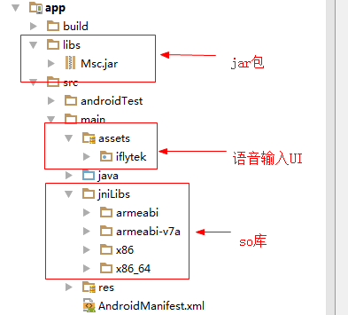

# 简介 #

本Demo是科大讯飞SDK的简单Demo，展示了语音识别和语音合成功能的使用。

# 集成步骤 #
## 1. 创建应用 ##
登录官网[科大讯飞开放平台](http://www.xfyun.cn/)，注册账号后登录，创建应用

## 2. 下载SDK ##

## 3. 集成SDK ##
将SDK的资源拷贝到项目，结果如下:

## 4. 语音识别 ##

    public void onRecognise(View view) {
        //1.创建RecognizerDialog对象
        RecognizerDialog mDialog = new RecognizerDialog(this, null);
        //2.设置accent、 language等参数
        mDialog.setParameter(SpeechConstant.LANGUAGE, "zh_cn");
        mDialog.setParameter(SpeechConstant.ACCENT, "mandarin");
        //若要将UI控件用于语义理解，必须添加以下参数设置，设置之后onResult回调返回将是语义理解
        //结果
        // mDialog.setParameter("asr_sch", "1");
        // mDialog.setParameter("nlp_version", "2.0");
        //3.设置回调接口
        mDialog.setListener(mRecognizerDialogListener);
        //4.显示dialog，接收语音输入
        mDialog.show();
    }

    private RecognizerDialogListener mRecognizerDialogListener =  new RecognizerDialogListener() {

        /**
         *
         * @param recognizerResult 语音识别结果
         * @param b true表示是标点符号
         */
        @Override
        public void onResult(RecognizerResult recognizerResult, boolean b) {
            // Toast.makeText(MainActivity.this, recognizerResult.getResultString(), Toast.LENGTH_LONG).show();
            if (b) {
                return;
            }
            ResultBean resultBean = mGson.fromJson(recognizerResult.getResultString(), ResultBean.class);
            List<ResultBean.WsBean> ws = resultBean.getWs();
            String w = "";
            for (int i = 0; i < ws.size(); i++) {
                List<ResultBean.WsBean.CwBean> cw = ws.get(i).getCw();
                for (int j = 0; j < cw.size(); j++) {
                    w += cw.get(j).getW();
                }
            }
            Toast.makeText(MainActivity.this, w, Toast.LENGTH_SHORT).show();
        }

        @Override
        public void onError(SpeechError speechError) {

        }
    };

## 5.语音合成 ##

    //新闻文本
    private static final String mNewsText = "剩给韩国队的时间不多了";

    public void onSynthesize(View view) {
        //1.创建 SpeechSynthesizer 对象, 第二个参数： 本地合成时传 InitListener
        SpeechSynthesizer mTts= SpeechSynthesizer.createSynthesizer(MainActivity.this, null);
        //2.合成参数设置，详见《 MSC Reference Manual》 SpeechSynthesizer 类
        //设置发音人（更多在线发音人，用户可参见 附录13.2
        mTts.setParameter(SpeechConstant.VOICE_NAME, "xiaoyan"); //设置发音人
        mTts.setParameter(SpeechConstant.SPEED, "50");//设置语速
        mTts.setParameter(SpeechConstant.VOLUME, "80");//设置音量，范围 0~100
        mTts.setParameter(SpeechConstant.ENGINE_TYPE, SpeechConstant.TYPE_CLOUD); //设置云端
        //设置合成音频保存位置（可自定义保存位置），保存在“./sdcard/iflytek.pcm”
        //保存在 SD 卡需要在 AndroidManifest.xml 添加写 SD 卡权限
        //仅支持保存为 pcm 和 wav 格式， 如果不需要保存合成音频，注释该行代码
        mTts.setParameter(SpeechConstant.TTS_AUDIO_PATH, "./sdcard/iflytek.pcm");
        //3.开始合成
        mTts.startSpeaking(mNewsText, null);
    }

# 其他 #

[SDK下载](http://www.xfyun.cn/sdk/dispatcher)

测试用appid 56f22e12 （可自行在官网注册，创建应用获取appid）

集成指南在下载下来的sdk里面
